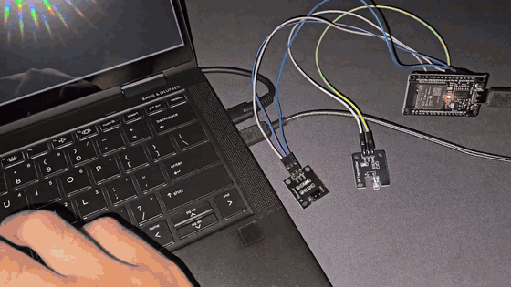
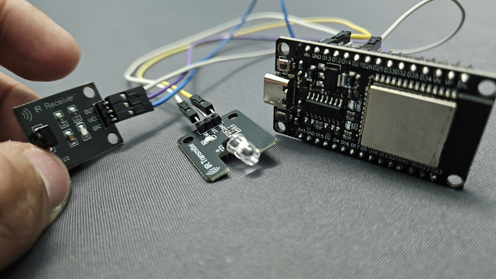
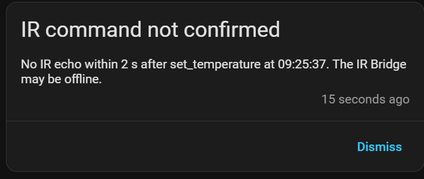

An ESP32 infrared bridge for Home Assistant that works without the internet.

It learns codes from your remotes and sends them back, so a TV, air conditioner, fan or anything else with an IR remote can be controlled from Home Assistant. If a command does not go out, Home Assistant tells you.

## Hardware

| Part | Pin | ESP32 |
|---|---|---|
| IR receiver | `VCC` | `3V3` |
| | `GND` | `GND` |
| | `OUT` | `D27` |
| IR transmitter | `VCC` | `VIN` |
| | `GND` | `GND` |
| | `DAT` | `D4` |

## What it does

- Learns any IR code it hears and shows it in Home Assistant.
- Sends saved or raw IR codes.
- Controls an air conditioner as a normal climate entity.
- Checks every command it sends and raises an alert if one is lost.
- Runs entirely on the local network.

## Setup

1. Run ESPHome and Home Assistant (Docker works fine).
2. Create `firmware/secrets.yaml` with `wifi_ssid`, `wifi_password`, `ota_password`, `api_encryption_key` and `fallback_ap_password`.
3. Flash `firmware/ir-bridge.yaml` to the ESP32 over USB.
4. Add the device in Home Assistant.
5. Import `homeassistant/ir_command_confirmation.yaml` as an automation to get alerts for lost commands.

The ESP32 only connects to 2.4 GHz WiFi.

How it was tested: [docs/measurements.md](docs/measurements.md). Test scripts are in `measure/`.

## License

GPLv3, see `LICENSE`. `firmware/components/` is derived from ESPHome (GPLv3). Remote captures in `measure/irdb/` come from Flipper-IRDB (CC0).
