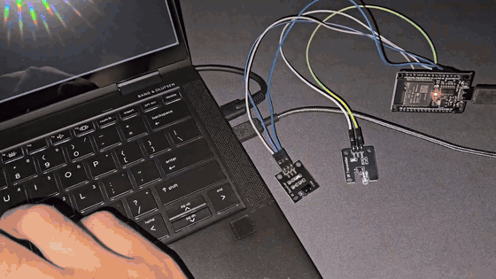
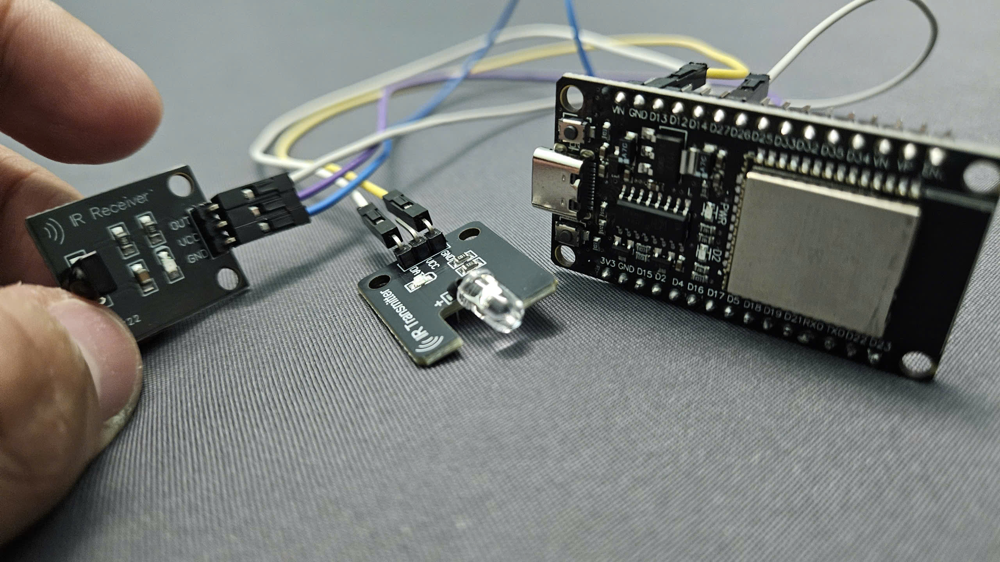
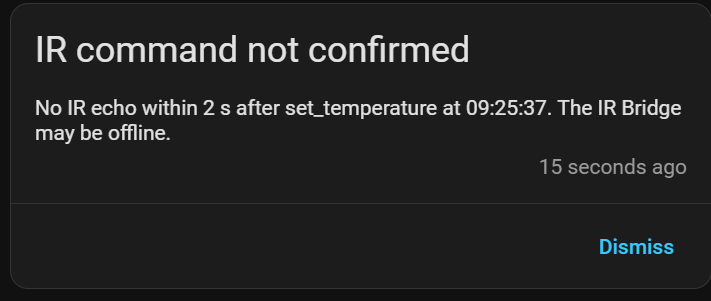

An ESP32 infrared bridge for Home Assistant that works without the internet.

It learns codes from your remotes and sends them back, so a TV, air conditioner, fan or anything else with an IR remote can be controlled from Home Assistant, or from the bridge's own web page when Home Assistant is off.

(For this project I used it on the TV and the Panasonic air conditioner at home.)

## Hardware

| Part | Pin | ESP32 |
|---|---|---|
| IR receiver | `VCC` | `3V3` |
| | `GND` | `GND` |
| | `OUT` | `D27` |
| IR transmitter | `VCC` | `VIN` |
| | `GND` | `GND` |
| | `DAT` | `D4` |

## What it does

- Learns a code when you press a button on the remote and keeps it on the ESP32 under a name (24 codes, kept through power loss).
- Sends saved or raw IR codes.
- Controls Daikin and Panasonic (RKR remote) air conditioners as normal climate entities.
- Listens to its own LED after every command and raises an alert if nothing came out.
- Has its own password-protected web page, so it keeps working with Home Assistant stopped.
- Runs entirely on the local network.

## Setup

1. Run ESPHome and Home Assistant (Docker works fine).
2. Create `firmware/secrets.yaml` with `wifi_ssid`, `wifi_password`, `ota_password`, `api_encryption_key`, `fallback_ap_password` and `web_password`.
3. Flash `firmware/ir-bridge.yaml` to the ESP32 over USB.
4. Add the device in Home Assistant.
5. Import `homeassistant/ir_command_confirmation.yaml` and `homeassistant/ir_code_confirmation.yaml` as automations to get alerts for lost commands.

To learn a code, type a name in `Code name`, press `Learn code` and press the button on the remote within a minute. `Send code` sends it back.

The ESP32 only connects to 2.4 GHz WiFi.

## Limits

- The IR transmitter module is weak. The TV works from close by, the wall-mounted air conditioner only when the bridge is held near it.
- The receiver fades out on codes that keep sending for more than about 300 ms, so very long codes (Hitachi 296-bit) do not learn cleanly.

Test results are in [docs/measurements.md](docs/measurements.md).
